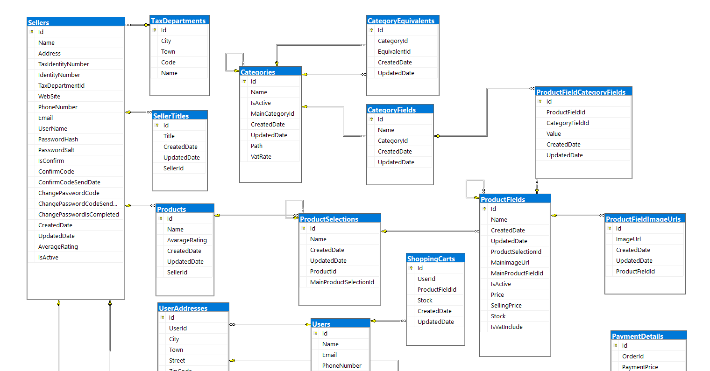
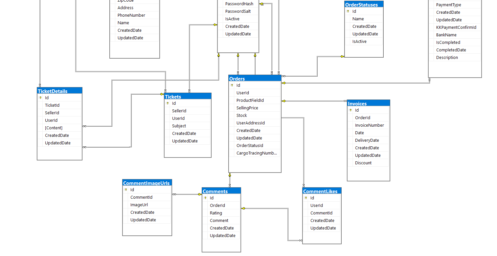

# E-Ticaret Veritabanı Tasarımı

Bu proje, bir e-ticaret platformunun temel yapı taşlarını oluşturmak amacıyla bir veritabanı tasarımını içerir. E-ticaret işlemlerinin düzenli bir şekilde yönetilmesi, verilerin güvenli ve yapılandırılmış bir şekilde saklanmasını kavrayabilmek adına tasarlanmıştır.

## Tablolar

Proje içerisinde aşağıdaki tablolar bulunmaktadır:

- **Users:** Kullanıcıların kaydedildiği tablo.
- **Sellers:** Satıcıların bilgilerinin saklandığı tablo.
- **Categories:** Ürün kategorilerinin ve alt kategorilerinin yönetildiği tablo.
- **Products:** Satılan ürünlerin detaylarının kaydedildiği tablo.
- **Orders:** Müşteri siparişlerinin takip edildiği tablo.
- **Invoices:** Siparişlere ait fatura bilgilerinin saklandığı tablo.
- **Payments:** Ödeme detaylarının kaydedildiği tablo.
- **Comments:** Ürünler hakkında yapılan yorumların saklandığı tablo.
- **ProductSelections:** Ürün seçeneklerinin yönetildiği tablo.
- **ProductFields:** Ürün özelliklerinin kaydedildiği tablo.
- **ShoppingCarts:** Müşteri alışveriş sepetlerinin yönetildiği tablo.
- **Addresses:** Kullanıcı adres bilgilerinin saklandığı tablo.
- **Tickets:** Kullanıcıların destek taleplerinin kaydedildiği tablo.
- **TicketDetails:** Destek talebi detaylarının saklandığı tablo.
- **OrderStatuses:** Sipariş durumlarının yönetildiği tablo.
- **PaymentDetails:** Ödeme detaylarının saklandığı tablo.
- **SellerTitles:** Satıcıların ünvanlarının kaydedildiği tablo.
- **TaxDepartments:** Vergi departmanları bilgilerinin saklandığı tablo.

## Amaç

Bu veritabanı tasarımı, e-ticaret platformunda gerçekleşen işlemleri takip etmek, ürün yönetimini kolaylaştırmak, siparişlerin durumunu izlemek ve müşteri ilişkilerini düzenlemek için oluşturulmuştur. Verilerin düzenli bir şekilde saklanması ve erişilmesi, işlemlerin daha etkili ve güvenli bir şekilde gerçekleştirilmesine yardımcı olur.

## E-Ticaret Veritabanı Diyagramı

